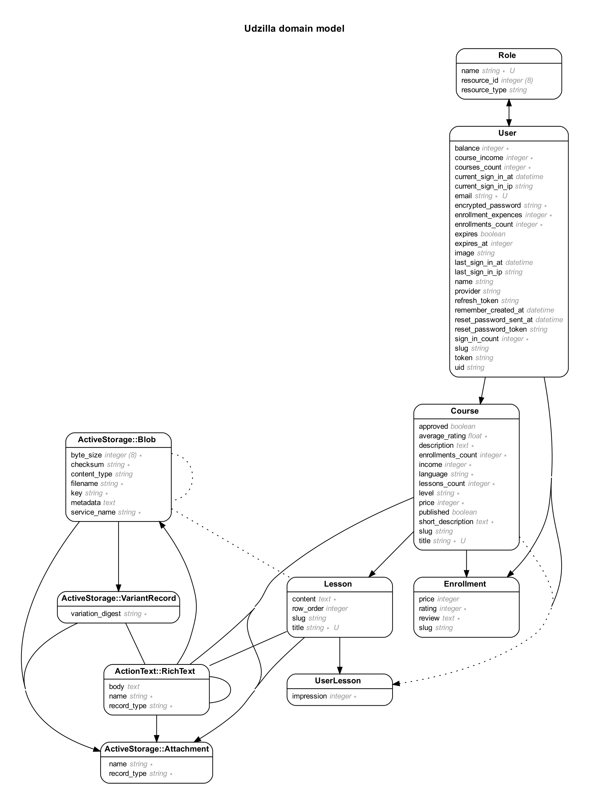

# Udzilla

> Udzilla is an E-learning platform with many features implemented to help students and teachers have the best experience of online learning,
> The project built to be a place for affordable learning material as it has free and paid courses,Also students will get certificates whether the course is paid or not,the platform has too many features and functionalities to include in a paragraph so Please visit the link below and see for yourself,
> As for the domain model of the project, I have included an ERD down below, Kindly check it out.

## Built With

- Ruby
- Ruby On Rails
- Javascript
- Bootstrap
- HAML
- AWS S3
- Twilio
- PostrgreSQL
- Lots of love :heart:

# Udzilla Domain Model

## Live Demo

[Udzilla Live Demo](https://udzilla.herokuapp.com)

👤 **Shaher Shamroukh**
 
[<code></code>](https://github.com/Shaher-11)
[<code></code>](https://twitter.com/ShaherShamroukh/)
[<code></code>](https://www.linkedin.com/in/shaher-shamroukh/)
 
 

## 🤝 Contributing

Contributions, issues, and feature requests are welcome!

Feel free to check the [issues page](https://github.com/Shaher-11/udzilla/issues).

## Show your support

Give a ⭐️ if you like this project!

## 📝 License

This project is [MIT](../LICENSE) licensed.
